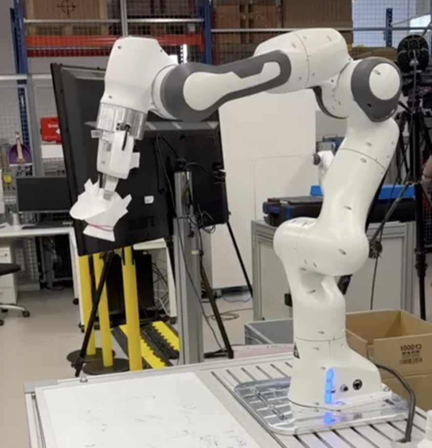

#  Cleaning Whiteboard Task

This project utilizes ROS (Robot Operating System) and C++ to implement advanced robot control techniques. Key features include impedance control and trajectory planning for robotic arms, focusing on responsive and precise movements.

## Impedance Control: 
The robot arm, equipped with a gripper, applies impedance control to detect force feedback when it touches the board. This control allows the arm to respond to contact forces, ensuring that the gripper understands when it reaches the board's surface based on the resistance encountered.

## Trajectory Planning: 
The robot follows a circular path to "draw" a circle on the board for the erasing motion. Upon reaching the board, it detects contact through force feedback and then traces its way back to the starting position, maintaining the same path to ensure accuracy and consistency in movements.
