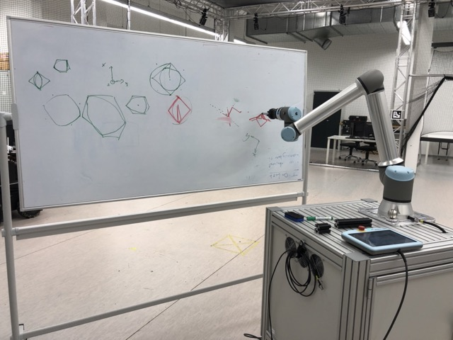

# Drawing a Circle with real UR10e Robot

This assignment challenges you to draw a circle on a whiteboard with a Universal Robots UR10e robot with a Robotiq HAND-E electric two-finger pinch gripper.

- **[Robot Video](media/UR10e_Robot.mp4)**

# Drawing a Circle with teach pendant and RoboDK
1) define home point in base frame
2) define and moveJ to entry point in base frame
3) define and moveJ to approach point in base frame 
4) define and moveJ to touch point in base frame 
5) use touch point as starting point in whiteboard frame
6) define via point in whiteboard frame
7) define end point in whiteboard frame
8) draw semi-circle with unconstrained circlemovement function in whiteboard frame
9) repeat steps 5 to 8 for the second half circle with appropriate new points

- **[Simulation Video](media/RoboDK_Simulation.webm)**

## Tools
- [Universal Robots Teach Pendant Simulator](https://github.com/UniversalRobots/RTDE_Python_Client_Library)
- [RoboDK Offline Programming Software](https://robodk.com/)